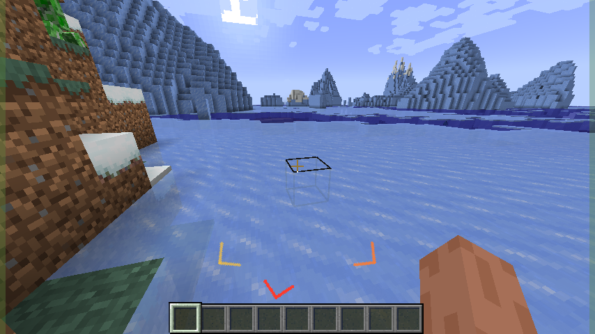
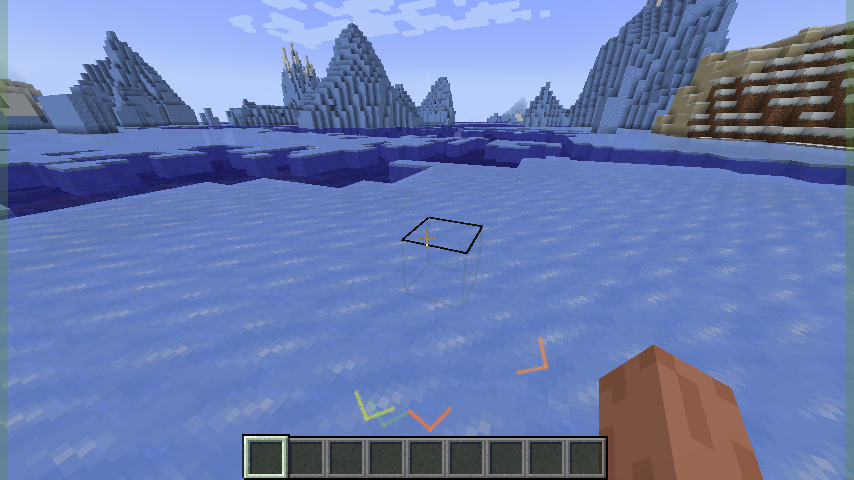

# CreeperSense

**CreeperSense** is a **client-only** mod that adds a gentle HUD warning when a **creeper is approaching from behind** — meant to be easier to notice than subtitles alone.

### How it works

- **Detection**: each tick, the mod looks for creepers within a horizontal radius and checks whether they’re in your **rear arc** (behind you).
- **Indicator**: when a threat is present, the HUD shows:
  - a subtle edge wash, and
  - one **chevron per creeper** behind you, arranged along a rear arc
- **Color/intensity**: chevrons fade **green → yellow → red** as danger increases, with a subtle pulse. If a creeper is **swelling**, its threat ramps up faster.

### Modes + settings

Open settings in-game with **O** (rebindable in Controls):

- **Chevrons**: default directional chevrons (one per creeper behind you).
- **Peripheral**: ARMA-style peripheral circles along the screen edge.
- **Meme (high danger)**: adds meme overlays only when danger is high (still keeps directional chevrons).

Optional:
- **Difficulty scaling**: reduces warning radius on higher difficulty to give you less time to react.

### Compatibility

- **Minecraft 1.20.1**
  - **Fabric** (requires Fabric API)
  - **Forge**
- **Minecraft 1.21.1**
  - **Fabric** (requires Fabric API)
  - **NeoForge**
- **Minecraft 26.1**
  - **Fabric** (requires Fabric API)
  - **NeoForge**

### Install

1. Download the jar that matches your **Minecraft version + mod loader** from GitHub Releases.
2. Put it into your `mods/` folder.
3. If you’re on **Fabric**, also install **Fabric API** for the same Minecraft version.

### Notes

- **Client-only**: servers do not need CreeperSense installed.
- **Performance**: designed to be lightweight (simple entity scan + HUD draw).

### For developers

If you want to build or contribute, see `CONTRIBUTING.md`.
